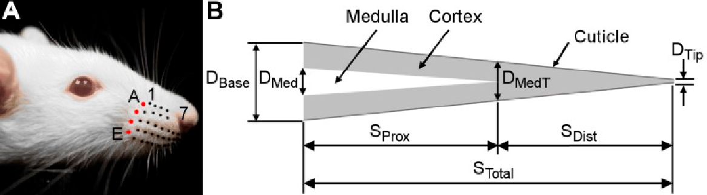

# Rat Whisker Geometry: download the 2D geometry of over 500 rat whiskers

[Belli et al. (2016)](https://journals.physiology.org/doi/full/10.1152/jn.00054.2016) performed a meta-analysis of the geometric properties of rodent whiskers from seven different studies (over 500 whiskers). All data are available for download.  The manuscript also provides equations for all whisker geometric parameters as functions of row and column position within the array. If you have more data that we can include Supplemental Table 1, please let us know.

Please cite the following article when using these data: Belli, HM, Yang AET, Bresee CS, and Hartmann MJZ (2016) Variations in vibrissal geometry across the rat mystacial pad: base diameter, medulla, and taper. Journal of Neurophysiology. doi: 10.1152/jn.00054.2016
  
[Supplemental Table 1](https://github.com/SeNSE-lab/RatWhiskerGeometry/blob/master/SupplementalTable_1.csv) is a comprehensive dataset containing all the data used in the paper. 

[Supplemental Table 2](https://github.com/SeNSE-lab/RatWhiskerGeometry/blob/master/SupplementalTable_2.pdf) is identical to Table 5 in the paper, re-formatted for readibility. 

See also the [complementary article by Yang et al (2019)](https://journals.physiology.org/doi/full/10.1152/jn.00869.2016), which quantifies vibrissal mechanical properties (mass, moments of inertia, etc.) across the rat mystacial pad. [You can download the mechanical properties of the whiskers here].(https://github.com/SeNSE-lab/RatWhiskerMechanicalProperties) Full citation: Yang AE, Belli HM, Hartmann MJZ (2019) Quantification of vibrissal mechanical properties across the rat mystacial pad.  J Neurophysiol.  121(5):1879-1895. doi: 10.1152/jn.00869.2016.  
 